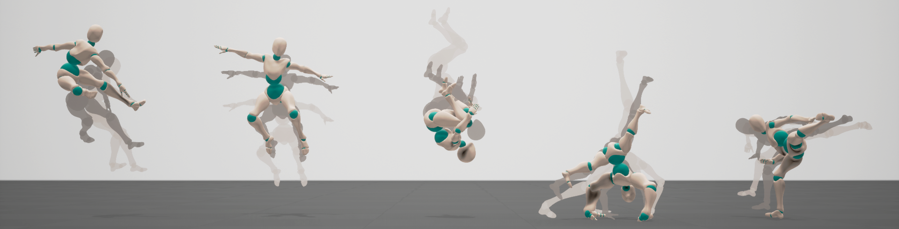

# Learning a family of motor skills from a single motion clip


## Abstract

This code implements the paper [Learning a family of motor skills from a single motion clip](http://mrl.snu.ac.kr/research/ProjectParameterizedMotion/ParameterizedMotion.html). 
This system learns parameterized motor skills from a single motion clip in physics simulation. 
Our algorithm can automatically spatio-temporally edit the given motion clip to satisfy given the task space.
This code is written in C++ and Python, based on [Tensorflow2](https://github.com/tensorflow/tensorflow) and [DartSim](https://github.com/dartsim/dart). 

## Publications

Seyoung Lee, Sunmin Lee, Yongwoo Lee and Jehee Lee. 2021. Learning a family of motor skills from a single motion clip. ACM Trans. Graph. 40, 4. (SIGGRAPH 2021)

Project page: http://mrl.snu.ac.kr/research/ProjectParameterizedMotion/ParameterizedMotion.html

Paper: http://mrl.snu.ac.kr/research/ProjectParameterizedMotion/ParameterizedMotion.pdf

Youtube: https://youtu.be/ihHttL-SeL4

## Installation
We checked code works in Ubuntu 18.04 and 20.04.

### Setup

All dependencies can be installed at once by the command below.
```bash
sudo ./install.sh
```
This script download sources on ``c_env`` and ``py_env`` and installs on the same directory.

### Building
You can build via:
```bash
sudo ./run_cmake.sh
cd build
make -jN
```

##  Render
You can render the input motion file/trained network by executing ``render`` file in ``build/render``. 
Sample motions, pretrained model and parameterized model are included in this repository.
You should activate the installed virtual environment by ``source ../py_env/bin/activate`` before running.

### View BVH file
You can load BVH files in ``data/motion``
```bash
./render --bvh=MOTION_FILE.bvh
```

### View pretrained network
You can load trained models in ``network/output``

```bash
./render --bvh=MOTION_FILE.bvh --ppo=PRETRAINED_NETWORK/network-0
```

### View parameterized network
You can load trained models in ``network/output``. You can set task parameter and see character tracking the reference generated from elite set or the reference generated from the parameterized network. Elite set data are not included in our sample model.
```bash
./render --bvh=MOTION_FILE.bvh --ppo=PARAMETERIZED_NETWORK/network-0 --parametric
```

## Train

Training consists of two stages: ``pretraining`` and ``parameterized learning``. 
Pretraining stage makes the agent able to track the given single motion before parameterized learning. 
We use modified version of [Deepmimic](https://github.com/xbpeng/DeepMimic) for pretraining.
Algorithm for parameterized learning is written in our paper.
All possible arguments are written in ``ppo.py``.

### Pretrain
```bash
python3 ppo.py --ref=MOTION_FILE.bvh --test_name=TEST_NAME --nslave=N
```
To load network,
```bash
python3 ppo.py --ref=MOTION_FILE.bvh --test_name=TEST_NAME --nslave=N --pretrain=network-0
```

### Parameterized learning
```bash
python3 ppo.py --ref=MOTION_FILE.bvh --test_name=TEST_NAME --nslave=N --pretrain=network-0 --parametric
```
To load parameterization network and elite set,
```bash
python3 ppo.py --ref=MOTION_FILE.bvh --test_name=TEST_NAME --nslave=N --pretrain=network-0 --parametric --load-param
```

## Customize
To customize the motion clip and task space, please follow steps below.

### Generate simulation character for new BVH files
You can automatically generate new skeleton that matches input BVH hierarchy by calling function below.
```bash
SIM::SkeletonBuilder::generateNewSkeleton(MOTION_PATH, SKELETON_PATH)
```
The default mass of each body is 5 and you can adjust it by directly editing the generated xml file.
After generating skeleton, you need to edit ``sim/Configurations.h`` to load new xml file and match body names. 
Make sure that generated xml file is in ``data/character``.

### Set the range of task space
You can set the range of task space by editing ``SIM::EliteSet::setConfigurations()`` function.

The parameters you need to edit are

``mNumParam`` : task dimension

``mParamMin`` : minimum point in task space

``mParamMax`` : maximum point in task space

``mParamUnit`` : diagonal matrix A which is used to calculate distance (See ``SIM::ParamTree::getDistance()``.)

``pBVH`` : task parameter of input motion

### Design task reward
You can design your own task reward by editing ``SIM::Controller::getTaskReward()`` function.

### Design fitness function (Optional)
The final results of parameterized motion depend on the design of fitness function. You can design fitness function by editing ``SIM::Controller::updateFitness()`` function. You may set weight of certain body part higher than other bodies to prevent undesirable deformation of the body.
